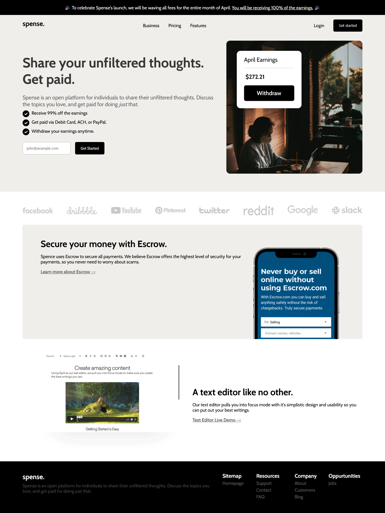

# Codewell - Snipper Landing Page solution

This is a solution to the [Spense Landing Page on Codewell](https://www.codewell.cc/challenges/spense-landing-page--608a7a859691700015db16c5).

## Table of contents

-   [Overview](#overview)
    -   [The challenge](#the-challenge)
    -   [Screenshot](#screenshot)
    -   [Links](#links)
-   [My process](#my-process)
    -   [Built with](#built-with)
    -   [What I learned](#what-i-learned)
-   [Author](#author)

## Overview

### The challenge

Users should be able to:

-   View the optimal layout depending on their device's screen size
-   Open the navigation bar on mobile layouts

### Screenshot

### Links

-   Solution URL: [Github](https://github.com/AdamEli/Spense-Landing-Page-Codewell)
-   Live Site URL: [Spense](https://spense-landing-page-codewell-eta.vercel.app/)

## My process

### Built with

-   Semantic HTML5 markup
-   CSS custom properties
-   Flexbox
-   Mobile-first workflow

### What I learned

I learned how to have a different number of social media logos based on the screen size.

## Author

-   Github - [Adam Elitzur](https://github.com/AdamEli?tab=repositories)
-   Twitter - [@adamcandoit](https://twitter.com/adamcandoit)
